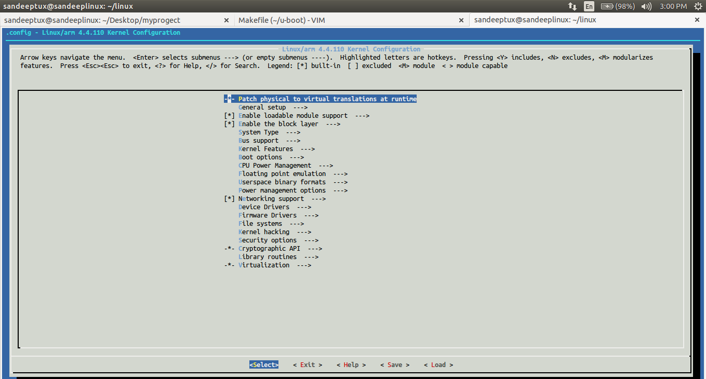

# Building kernel-4.4 and Uboot-2018 and Ubuntu-16.04 Rootfs from scratch for the BeagleBoneBlack


## Introduction

Always i was getting `KERNEL PANIC`  :rage: or `Booting error` :weary: in my own BeagleBoneBlack Board.Here's a really "simple" guide on how to build U-Boot-2018 and Linux kernel-4.4 from scratch for the BeagleBone SoC. This is mostly a reminder of the steps for myself and shows what I recently learned from lots of different sources and by trial and error method.

This post describes the setup detail for installing Ubuntu based distro in BeagleBoneBlack Board. Details are described on:


- [x] Take board(BBB), Setting the host(X86 Intel Ubuntu-14.04).
- [x] Download and compile uboot`(MLO ,u-boot.img)` , dtb`(am335x-boneblack.dtb)` and and the Kernel`(zImage)` image on your board.
- [x] Install rootfs and Installing needed packages.
- [x] Setting with SD image.
- [x] Setting Ubuntu on target.

##  1. Download the GCC Linaro ARM Cross Compiler Toolchain:and extract it on Host machine(x86):
```
sandeeptux@sandeeplinux:~$ wget -c https://releases.linaro.org/components/toolchain/binaries/7.4-2019.02/arm-linux-gnueabihf/gcc-linaro-7.4.1-2019.02-x86_64_arm-linux-gnueabihf.tar.xz

sandeeptux@sandeeplinux:~$ tar xf gcc-linaro-7.4.1-2019.02-x86_64_arm-linux-gnueabihf.tar.xz 

Note:if any error we got like ERROR: no certificate subject alternative name matches
	requested host name ‘releases.linaro.org’.
To connect to releases.linaro.org insecurely, use `--no-check-certificate'.

solve : wget -c --no-check-certificate https://releases.linaro.org/components/toolchain/binaries/7.4-2019.02/arm-linux-gnueabihf/gcc-linaro-7.4.1-2019.02-x86_64_arm-linux-gnueabihf.tar.xz

```
**Create general variable environments:**
```
sandeeptux@sandeeplinux:~$ export ARCH=arm

sandeeptux@sandeeplinux:~$ export CROSS_COMPILE=/home/sandeeptux/gcc-linaro-7.4.1-2019.02-x86_64_arm-linux-gnueabihf/bin/arm-linux-gnueabihf-
```

## Required Tools for Host machine (x86 intel Ubuntu-14.04) :

**_Note:Connect the USB side of the TTL cable to your computer.
Connect the wires to the J1 headers on your BeagleBone Black as shown:_**

Black wire to Pin 1

Green wire to Pin 4

White wire to Pin 5


I'm using here GTKterm as an example but any other debug terminal program can be used like [Minicom](http://processors.wiki.ti.com/index.php/Setting_up_Minicom_in_Ubuntu).


### 1-install minicom (command line serial port terminal)

`sandeeptux@sandeeplinux:~$ sudo apt-get install minicom`

`  sandeeptux@sandeeplinux:~$sudo minicom -s`
```


  	    +-----[configuration]------+
            | Filenames and paths      |
            | File transfer protocols  |
            | Serial port setup        |
            | Modem and dialing        |
            | Screen and keyboard      |
            | Save setup as dfl        |
            | Save setup as..          |
            | Exit                     |
            | Exit from Minicom        |
            +--------------------------+
then come down by using down arrow choose ---->Serial port setup
    +-----------------------------------------------------------------------+
    | A -    Serial Device      : /dev/ttyUSB0                              |
    | B - Lockfile Location     : /var/lock                                 |
    | C -   Callin Program      :                                           |
    | D -  Callout Program      :                                           |
    | E -    Bps/Par/Bits       : 115200 8N1                                |
    | F - Hardware Flow Control : No                                        |
    | G - Software Flow Control : No                                        |
    |                                                                       |
    |    Change which setting?                                              |
    +-----------------------------------------------------------------------+
    
``` 
## OR 
2. **_GTKterm - (GUI based serial port terminal)_**

Setup the communication with a terminal window so that commands can be exchanged with the application running in the Board on the development board.

`sandeeptux@sandeeplinux:~$ sudo apt-get update`

`sandeeptux@sandeeplinux:~$ sudo apt-get install gtkterm`


`sandeeptux@sandeeplinux:~$ dmesg | tail -8`
```

[19543.479877] hid-generic 0003:0E8F:0022.0005: input,hidraw2: USB HID v1.10 Device [GASIA USB KB V11] on usb-0000:00:14.0-2.4/input1
[19545.727769] usb 2-2.1: new full-speed USB device number 8 using xhci_hcd
[19545.816485] usb 2-2.1: New USB device found, idVendor=067b, idProduct=2303
[19545.816491] usb 2-2.1: New USB device strings: Mfr=1, Product=2, SerialNumber=0
[19545.816495] usb 2-2.1: Product: USB-Serial Controller
[19545.816498] usb 2-2.1: Manufacturer: Prolific Technology Inc.
[19545.817235] pl2303 2-2.1:1.0: pl2303 converter detected
[19545.818262] usb 2-2.1: pl2303 converter now attached to ttyUSB0

```
`sandeeptux@sandeeplinux:~$ sudo gtkterm`


* Provide your sudo password and the serial terminal GUI will appear. Click 'Configuration' and select 'Port', as shown in the figure below.


* In the pop-up window browse to the USB TTY port as shown in the figure below.


2.**_ncurses - (GUI based user interfaces in a terminal-independent manner)_** [ncurses](https://www.gnu.org/software/ncurses/ncurses.html).

```
sandeeptux@sandeeplinux:~$ sudo apt-get update
sandeeptux@sandeeplinux:~$ sudo apt install libncurses5-dev libncursesw5-dev

```



## Bootloader: U-Boot

The first step is to build the bootloader, U-Boot. Two important files will come out of this process: `MLO` and `u-boot.img`. MLO is what the U-Boot community calls the SPL (Secondary Program Loader) and contains executable code for the second boot stage. 
1. The on-board ROM initializes a 1 CPU cores and searches for a file called MLO on the first FAT partition of the first SD card, then loads it in memory and executes it
2. The SPL (MLO) initializes a few other things and searches on the same partition for u-boot.img, which is the third boot stage (the actual complete U-Boot program), loads it in memory and executes it
    
```
sandeeptux@sandeeplinux:~$ git clone https://github.com/u-boot/u-boot
sandeeptux@sandeeplinux:~$ cd u-boot/
sandeeptux@sandeeplinux:~$ git checkout v2018.01 
sandeeptux@sandeeplinux:~$ make am335x_boneblack_defconfig 
sandeeptux@sandeeplinux:~$ make -j4
sandeeptux@sandeeplinux:~/u-boot$ ls
```
output file:

- [x] u-boot.bin-> is the binary compiled U-Boot bootloader.

- [x] u-boot.img-> contains u-boot.bin along with an additional header to be used by the boot ROM to determine how and where to load and execute U-Boot.

- [x] MLO-> The second stage bootloader is known as the SPL, but is sometimes referred to as the MLO.
            The SPL is the first stage of U-boot, and must be loaded from one of the boot sources into internal RAM.
            For MLO use the spl/u-boot-spl.bin file. The difference between u-boot-spl.bin and 
            MLO is that u-boot-spl.bin does not contain header information. Peripheral boot needs an MLO without header

Best Doc for TI Booting Process-> [TI The Boot Process](http://processors.wiki.ti.com/index.php/The_Boot_Process)

## Linux Kernel 

```
sandeeptux@sandeeplinux:~$ git clone https://github.com/beagleboard/linux.git
sandeeptux@sandeeplinux:~$ cd linux
sandeeptux@sandeeplinux:~/linux$ make bb.org_defconfig   
sandeeptux@sandeeplinux:~/linux$ make uImage LOADADDR=0x80008000 -j4
sandeeptux@sandeeplinux:~/linux$ make dtbs
sandeeptux@sandeeplinux:~/linux$ make modules -j4 
```
## OR

`sandeeptux@sandeeplinux:~/linux$ make uImage LOADADDR=0x80008000 -j4 uImage modules dtbs`

### Note: General error During Compilation 

### 1.Kernel compression Error 
```
sandeeptux@sandeeplinux:~/linux$ make uImage LOADADDR=0x80008000 -j4
LZO     arch/arm/boot/compressed/piggy.lzo
/bin/sh: 1: lzop: not found
make[2]: *** [arch/arm/boot/compressed/piggy.lzo] Error 1
make[1]: *** [arch/arm/boot/compressed/vmlinux] Error 2
make: *** [zImage] Error 2
```

### Error Solution

`sandeeptux@sandeeplinux:~/linux$ make menuconfig`
```
CONFIG_KERNEL_GZIP:                                                                                                                                                                      
The old and tried gzip compression. It provides a good balance between compression ratio and decompression speed.                                                                                                                                       

Symbol: KERNEL_GZIP 

 Location:
->General Setup
   -> Kernel compression mode  (<choice> [=y]) 
```
```

|─────────────────── Kernel compression mode ───────────────────┐
│  Use the arrow keys to navigate this window or press the      │  
│  hotkey of the item you wish to select followed by the <SPACE │ 
│  BAR>. Press <?> for additional information about this        │  
│ ┌───────────────────────────────────────────────────────────┐ │  
│ │                         (X) Gzip                          │ │  
│ │                         ( ) LZMA                          │ │  
│ │                         ( ) XZ                            │ │  
│ │                         ( ) LZO                           │ │  
│ │                         ( ) LZ4                           │ │  
│ │                                                           │ │ 
└─────────────────────────────────────────────────────────────  │  
├───────────────────────────────────────────────────────────────┤  
│                    <Select>      < Help >                     │  
└───────────────────────────────────────────────────────────────|
```
### 2.Kernel compression Error 

`Makefile:686: Cannot use CONFIG_CC_STACKPROTECTOR_STRONG: -fstack-protector-strong not supported by compiler`

### Error Solution 

` sandeeptux@sandeeplinux:~/linux$ export CROSS_COMPILE=/home/sandeeptux/gcc-linaro-6.4.1-2017.11-x86_64_arm-linux-gnueabihf/bin/arm-linux-gnueabihf-`

Let me explain what are the important files in `arch/arm/boot` those two targets will create while this is compiling:

- [x] `zImage`-> this is a self-extracting compressed kernel. You execute this file, and it has a decompression (gzip) algorithm to extract the rest of it, which is the actual kernel to execute.`zimage` can load any where in RAM.`zimage` is called position independent.
- [x] `uImage`-> this is `zImage` with a 64-byte U-Boot header so that U-Boot knows a few things when asked to boot this file.
                while `uImage` can load the  address has to provide.
```              
Ex: make ARCH=arm CROSS_COMPILE=arm-linux-gnueabihf- uImage LOADADDR=0x80008000 -j4

LOADADDR :
                Start_address (hex)        End_address (hex)       Size            Description
  SDRAM          0x8000_0000               0xBFFF_FFFF             1GB             8-/16-bit External Memory
  
  uImage = Load address + absolute entry point 
```

- [x] `dts/am335x-bone.dtb`-> the compiled device tree "blob" which the kernel must have in order to initialize its drivers and SoC-specific routines`


## Creating a root filesystem

The kernel will be able to start booting with the above files, but won't be able to finish because it will complain it cannot find any root filesystem.

DOWNLOAD [Prebuilt Ubuntu-16 Rootfs](https://github.com/sandeepbhuyan/BeagleBoneBlackRootfsUbuntu-16.04/archive/master.zip)

### OR

`sandeeptux@sandeeplinux:~$ git clone https://github.com/sandeepbhuyan/BeagleBoneBlackRootfsUbuntu-16.04.git`

```
sandeeptux@sandeeplinux:~$ cd BeagleBoneBlackRootfsUbuntu-16.04/
sandeeptux@sandeeplinux:~/BeagleBoneBlackRootfsUbuntu-16.04$ ls
bin  boot  dev  etc  home  lib  media  mnt  opt  proc  root  run  sbin  srv  sys  tmp  usr  var
```
## `uEnv.txt` automating the booting process (for SD Card)
```
loadaddr=0x82000000
fdtaddr=0x88000000
rdaddr=0x88080000

initrd_high=0xffffffff
fdt_high=0xffffffff

#for single partitions:

mmcroot=/dev/mmcblk0p1
loadximage=load mmc 0:1 ${loadaddr} /boot/vmlinuz-${uname_r}
loadxfdt=load mmc 0:1 ${fdtaddr} /boot/dtbs/${uname_r}/${fdtfile}
loadxrd=load mmc 0:1 ${rdaddr} /boot/initrd.img-${uname_r}; setenv rdsize ${filesize}
loaduEnvtxt=load mmc 0:1 ${loadaddr} /boot/uEnv.txt ; env import -t ${loadaddr} ${filesize};
loadall=run loaduEnvtxt; run loadximage; run loadxfdt;

mmcargs=setenv bootargs console=tty0 console=${console} ${optargs} ${cape_disable} ${cape_enable} root=${mmcroot} rootfstype=${mmcrootfstype} ${cmdline}

uenvcmd=run loadall; run mmcargs; bootz ${loadaddr} - ${fdtaddr};
```

# SD Card


For SD Card if we have microSD ADAPTER ->> /dev/mmcblk0p1 ,/dev/mmcblk0p2 
```
sandeeptux@sandeeplinux:~$ dmesg | tail -3
[54971.955024]  mmcblk0: p1 p2
[54972.249471] FAT-fs (mmcblk0p1): Volume was not properly unmounted. Some data may be corrupt. Please run fsck.
[54972.255273] EXT4-fs (mmcblk0p2): mounted filesystem with ordered data mode. Opts: (null)
 ```
 
if we have SD Card USB ADAPTER ->> /dev/sdb1, /dev/sdb2,
```
sandeeptux@sandeeplinux:~$ dmesg | tail -4
[55342.206940]  sdb: sdb1 sdb2
[55342.688420] FAT-fs (sdb1): Volume was not properly unmounted. Some data may be corrupt. Please run fsck.
[55342.699352] EXT4-fs (sdb2): mounted filesystem with ordered data mode. Opts: (null)
[55345.084561] systemd-hostnamed[22617]: Warning: nss-myhostname is not installed. Changing the local hostname might make it unresolveable. Please install nss-myhostname!

```
## Create Partition layout:
```
sandeeptux@sandeeplinux:~$ sudo fdisk /dev/sdb

Command (m for help): p

Disk /dev/sdb: 15.9 GB, 15931539456 bytes
64 heads, 32 sectors/track, 15193 cylinders, total 31116288 sectors
Units = sectors of 1 * 512 = 512 bytes
Sector size (logical/physical): 512 bytes / 512 bytes
I/O size (minimum/optimal): 512 bytes / 512 bytes
Disk identifier: 0x00000000

   Device Boot      Start         End      Blocks   Id  System
/dev/sdb1   *        2048     2099199     1048576    c  W95 FAT32 (LBA)
/dev/sdb2         2099200    31116287    14508544   83  Linux
```
Format partition 1 as FAT by typing `(sudo mkfs.vfat /dev/sdb1 )`

name change to `BOOT`- `sudo mkfs.vfat -F 32 -n "BOOT" /dev/sdb1`

Format partition 2 as ext4 by typing `(sudo mkfs.ext4 /dev/sdb2 )`

name change to `ROOTFS`- `sudo mkfs.ext4 -L "ROOTFS" /dev/sdb2`


### Now Final  Bringing it all together:

Creat 2 empty directory `(ex:boothost)`  `(ex:rootfshost)` for Copy Ubuntu-16.04 Rootfs from Host machine to SD card(SD Card USB ADAPTER) by help up virtual mount Setup SD card. In my case i have created 2 Directory in home Directory 

`1-boothost  (For /media/sandeeptux/BOOT) `

`2-rootfshost (For media/sandeeptux/ROOTFS)`
```
                      filesystem mount               External mount media device       copy contain
boothost<------------>/dev/sdb1/<--------------------->/media/sandeeptux/BOOT<------>MLO , u-boot.img 
rootfshost<---------->/dev/sdb2/<--------------------->/media/sandeeptux/ROOTFS<---->rootfs,zImage,uEnv.txt,am335x-boneblack.dtb
```
```
sandeeptux@sandeeplinux:~$ sudo mount /dev/sdb1/ boothost
sandeeptux@sandeeplinux:~$ sudo mount /dev/sdb2/ rootfshost

```
```
For 1st partion U-boot(MLO,u-boot.img):

sandeeptux@sandeeplinux:~/u-boot$ sudo cp MLO u-boot.img /home/sandeeptux/boothost/

For 2nd partion Rootfs (zImage,uEnv.txt,dtb):

sandeeptux@sandeeplinux:~$ cd BeagleBoneBlackRootfsUbuntu-16.04/

sandeeptux@sandeeplinux:~/BeagleBoneBlackRootfsUbuntu-16.04$ cp * -R rootfshost

sandeeptux@sandeeplinux:~/BeagleBoneBlackRootfsUbuntu-16.04$ sync

sandeeptux@sandeeplinux:~/linux/arch/arm/boot$ sudo cp zImage /home/sandeeptux/rootfshost/boot

sandeeptux@sandeeplinux:~/linux/arch/arm/boot/dts$ sudo cp am335x-* /home/sandeeptux/rootfshost/boot

sandeeptux@sandeeplinux:~$ sudo cp uEnv.txt rootfshost/boot

sandeeptux@sandeeplinux:~$ sudo chown root:root rootfshost

sandeeptux@sandeeplinux:~$ sudo chmod 755 rootfshost

sandeeptux@sandeeplinux:~$ sudo chown root:root rootfshost/usr/bin/sudo  

sandeeptux@sandeeplinux:~$ sudo chmod 4755 rootfshost/usr/bin/sudo

sandeeptux@sandeeplinux:~$ sudo umount boothost

sandeeptux@sandeeplinux:~$ sudo umount rootfshost

```
 ## Note: If you have issues with sudo on user UID in BeagleboneBlack kernel ,
 
error : `sudo: /usr/bin/sudo must be owned by uid 0 and have the setuid bit set`
```
solution:
sandeeptux@sandeeplinux:~$ sudo chown root:root rootfshost//usr/bin/sudo  
sandeeptux@sandeeplinux:~$ sudo chmod 4755 rootfshost/usr/bin/sudo
```

## Edit networks interfaces and append in the existing file:
```
$ sudo nano etc/network/interfaces  
auto lo  
iface lo inet loopback  
auto eth0  
iface eth0 inet dhcp
```

Remove SD card:


sandeeptux@sandeeplinux:~$ sudo umount /media/sandeeptux/BOOT

sandeeptux@sandeeplinux:~$ sudo umount /media/sandeeptux/ROOTFS

## Now connect your SD card in BeagleBoneBlack and press S2 switch and connect power supply

###      username:ubuntu 
###      password:temppwd

`sandeeptux@sandeeplinux:~$ sudo gtkterm`
```

U-Boot SPL 2018.01-00531-g748277c (Jan 27 2018 - 22:04:49)
Trying to boot from MMC1                
*** Warning - bad CRC, using default environment
                                        
                                        
                                        
U-Boot 2018.01-00531-g748277c (Jan 27 2018 - 22:04:49 +0530)
                                        
CPU  : AM335X-GP rev 2.1                
Model: TI AM335x BeagleBone Black       
DRAM:  512 MiB
NAND:  0 MiB
MMC:   OMAP SD/MMC: 0, OMAP SD/MMC: 1
*** Warning - bad CRC, using default environment

No USB device found
<ethaddr> not set. Validating first E-fuse MAC
Net:   eth0: ethernet@4a100000
Hit any key to stop autoboot:  0 
switch to partitions #0, OK
mmc0 is current device
SD/MMC found on device 0
** Unable to read file boot.scr **
** Unable to read file uEnv.txt **
switch to partitions #0, OK
mmc0 is current device
Scanning mmc 0:1...
switch to partitions #0, OK
mmc0 is current device
SD/MMC found on device 0
8039024 bytes read in 617 ms (12.4 MiB/s)
62765 bytes read in 154 ms (397.5 KiB/s)
## Flattened Device Tree blob at 88000000
   Booting using the fdt blob at 0x88000000
   Loading Device Tree to 8ffed000, end 8ffff52c ... OK

Starting kernel ...

[    0.000000] Booting Linux on physical CPU 0x0
[    0.000000] Initializing cgroup subsys cpuset
[    0.000000] Initializing cgroup subsys cpu
[    0.000000] Initializing cgroup subsys cpuacct
[    0.000000] Linux version 4.4.110 (sandeeptux@sandeeplinux) (gcc version 6.4.1 20171012 (Linaro GCC 6.4-2017.11) ) #1 SMP Sun Feb 4 10:52:20 IST 2018
[    0.000000] CPU: ARMv7 Processor [413fc082] revision 2 (ARMv7), cr=10c5387d
[    0.000000] CPU: PIPT / VIPT nonaliasing data cache, VIPT aliasing instruction cache
[    0.000000] Machine model: TI AM335x BeagleBone Black
[    0.000000] cma: Reserved 48 MiB at 0x9c800000
[    0.000000] Memory policy: Data cache writeback
[    0.000000] CPU: All CPU(s) started in SVC mode.
[    0.000000] AM335X ES2.1 (sgx neon )
[    0.000000] PERCPU: Embedded 13 pages/cpu @df91d000 s24140 r8192 d20916 u53248
[    0.000000] Built 1 zonelists in Zone order, mobility grouping on.  Total pages: 129408
[    0.000000] Kernel command line: console=ttyO0,115200n8 root=PARTUUID=00000000-02 rw rootfstype=ext4 rootwait
[    0.000000] PID hash table entries: 2048 (order: 1, 8192 bytes)
[    0.000000] Dentry cache hash table entries: 65536 (order: 6, 262144 bytes)
[    0.000000] Inode-cache hash table entries: 32768 (order: 5, 131072 bytes)
[    0.000000] Memory: 449376K/522240K available (11749K kernel code, 955K rwdata, 3908K rodata, 764K init, 854K bss, 23712K reserved, 49152K cma-reserved, 0K highmem)
[    0.000000] Virtual kernel memory layout:
[    0.000000]     vector  : 0xffff0000 - 0xffff1000   (   4 kB)
[    0.000000]     fixmap  : 0xffc00000 - 0xfff00000   (3072 kB)
[    0.000000]     vmalloc : 0xe0800000 - 0xff800000   ( 496 MB)
[    0.000000]     lowmem  : 0xc0000000 - 0xe0000000   ( 512 MB)
[    0.000000]     pkmap   : 0xbfe00000 - 0xc0000000   (   2 MB)
[    0.000000]     modules : 0xbf000000 - 0xbfe00000   (  14 MB)
[    0.000000]       .text : 0xc0008000 - 0xc0f5274c   (15658 kB)
[    0.000000]       .init : 0xc0f53000 - 0xc1012000   ( 764 kB)
[    0.000000]       .data : 0xc1012000 - 0xc1100e58   ( 956 kB)
[    0.000000]        .bss : 0xc1103000 - 0xc11d8820   ( 855 kB)
[    0.000000] SLUB: HWalign=64, Order=0-3, MinObjects=0, CPUs=1, Nodes=1
[    0.000000] Hierarchical RCU implementation.
[    0.000000]  Build-time adjustment of leaf fanout to 32.
[    0.000000]  RCU restricting CPUs from NR_CPUS=2 to nr_cpu_ids=1.
[    0.000000] RCU: Adjusting geometry for rcu_fanout_leaf=32, nr_cpu_ids=1
[    0.000000] NR_IRQS:16 nr_irqs:16 16
[    0.000000] IRQ: Found an INTC at 0xfa200000 (revision 5.0) with 128 interrupts
[    0.000000] OMAP clockevent source: timer2 at 24000000 Hz
[    0.000016] sched_clock: 32 bits at 24MHz, resolution 41ns, wraps every 89478484971ns
[    0.000038] clocksource: timer1: mask: 0xffffffff max_cycles: 0xffffffff, max_idle_ns: 79635851949 ns
[    0.000051] OMAP clocksource: timer1 at 24000000 Hz
[    0.000913] clocksource_probe: no matching clocksources found
[    0.001118] Console: colour dummy device 80x30
[    0.001145] WARNING: Your 'console=ttyO0' has been replaced by 'ttyS0'
[    0.001153] This ensures that you still see kernel messages. Please
[    0.001159] update your kernel commandline.
[    0.001180] Calibrating delay loop... 995.32 BogoMIPS (lpj=1990656)
[    0.046714] pid_max: default: 32768 minimum: 301
[    0.046862] Security Framework initialized
[    0.046876] Yama: becoming mindful.
[    0.046913] AppArmor: AppArmor disabled by boot time parameter
[    0.047082] Mount-cache hash table entries: 1024 (order: 0, 4096 bytes)
[    0.047096] Mountpoint-cache hash table entries: 1024 (order: 0, 4096 bytes)
[    0.047958] Initializing cgroup subsys io
[    0.047993] Initializing cgroup subsys memory
[    0.048038] Initializing cgroup subsys devices
[    0.048058] Initializing cgroup subsys freezer
[    0.048075] Initializing cgroup subsys net_cls
[    0.048091] Initializing cgroup subsys perf_event
[    0.048105] Initializing cgroup subsys net_prio
[    0.048131] Initializing cgroup subsys pids
[    0.048184] CPU: Testing write buffer coherency: ok
[    0.048244] ftrace: allocating 35998 entries in 106 pages
[    0.150474] CPU0: thread -1, cpu 0, socket -1, mpidr 0
[    0.150608] Setting up static identity map for 0x80008280 - 0x800082e0
[    0.155081] Brought up 1 CPUs
[    0.155107] SMP: Total of 1 processors activated (995.32 BogoMIPS).
[    0.155115] CPU: All CPU(s) started in SVC mode.
[    0.156702] devtmpfs: initialized
[    0.176313] VFP support v0.3: implementor 41 architecture 3 part 30 variant c rev 3
[    0.197663] omap_hwmod: debugss: _wait_target_disable failed
[    0.251557] clocksource: jiffies: mask: 0xffffffff max_cycles: 0xffffffff, max_idle_ns: 7645041785100000 ns
[    0.251594] futex hash table entries: 256 (order: 2, 16384 bytes)
[    0.255754] xor: measuring software checksum speed
[    0.294713]    arm4regs  :  1219.000 MB/sec
[    0.334710]    8regs     :   957.000 MB/sec
[    0.374708]    32regs    :  1089.000 MB/sec
[    0.414707]    neon      :  1743.000 MB/sec
[    0.414716] xor: using function: neon (1743.000 MB/sec)
[    0.414841] pinctrl core: initialized pinctrl subsystem
[    0.416348] NET: Registered protocol family 16
[    0.419193] DMA: preallocated 256 KiB pool for atomic coherent allocations
[    0.420136] cpuidle: using governor ladder
[    0.420157] cpuidle: using governor menu
[    0.425901] OMAP GPIO hardware version 0.1
[    0.439072] No ATAGs?
[    0.439105] hw-breakpoint: debug architecture 0x4 unsupported.
[    0.439655] omap4_sram_init:Unable to allocate sram needed to handle errata I688
[    0.439670] omap4_sram_init:Unable to get sram pool needed to handle errata I688
[    0.518739] raid6: neonx2   gen()  1876 MB/s
[    0.586729] raid6: neonx2   xor()  1167 MB/s
[    0.586738] raid6: using algorithm neonx2 gen() 1876 MB/s
[    0.586745] raid6: .... xor() 1167 MB/s, rmw enabled
[    0.586752] raid6: using intx1 recovery algorithm
[    0.596100] edma 49000000.edma: TI EDMA DMA engine driver
[    0.599303] vgaarb: loaded
[    0.599952] SCSI subsystem initialized
[    0.600705] usbcore: registered new interface driver usbfs
[    0.600784] usbcore: registered new interface driver hub
[    0.600889] usbcore: registered new device driver usb
[    0.601521] omap_i2c 44e0b000.i2c: could not find pctldev for node /ocp/l4_wkup@44c00000/scm@210000/pinmux@800/pinmux_i2c0_pins, deferring probe
[    0.603111] omap_i2c 4819c000.i2c: bus 2 rev0.11 at 100 kHz
[    0.603388] media: Linux media interface: v0.10
[    0.603462] Linux video capture interface: v2.00
[    0.603586] pps_core: LinuxPPS API ver. 1 registered
[    0.603594] pps_core: Software ver. 5.3.6 - Copyright 2005-2007 Rodolfo Giometti <giometti@linux.it>
[    0.603624] PTP clock support registered
[    0.604526] omap-mailbox 480c8000.mailbox: omap mailbox rev 0x400
[    0.605973] NetLabel: Initializing
[    0.605990] NetLabel:  domain hash size = 128
[    0.605997] NetLabel:  protocols = UNLABELED CIPSOv4
[    0.606060] NetLabel:  unlabeled traffic allowed by default
[    0.606411] clocksource: Switched to clocksource timer1
[    0.719202] NET: Registered protocol family 2
[    0.720063] TCP established hash table entries: 4096 (order: 2, 16384 bytes)
[    0.720114] TCP bind hash table entries: 4096 (order: 3, 32768 bytes)
[    0.720173] TCP: Hash tables configured (established 4096 bind 4096)
[    0.720245] UDP hash table entries: 256 (order: 1, 8192 bytes)
[    0.720266] UDP-Lite hash table entries: 256 (order: 1, 8192 bytes)
[    0.720606] NET: Registered protocol family 1
[    0.721210] RPC: Registered named UNIX socket transport module.
[    0.721227] RPC: Registered udp transport module.
[    0.721234] RPC: Registered tcp transport module.
[    0.721240] RPC: Registered tcp NFSv4.1 backchannel transport module.
[    0.722257] hw perfevents: enabled with armv7_cortex_a8 PMU driver, 5 counters available
[    0.725184] audit: initializing netlink subsys (disabled)
[    0.725282] audit: type=2000 audit(0.656:1): initialized
[    0.735611] zbud: loaded
[    0.736357] VFS: Disk quotas dquot_6.6.0
[    0.736632] VFS: Dquot-cache hash table entries: 1024 (order 0, 4096 bytes)
[    0.739567] NFS: Registering the id_resolver key type
[    0.739642] Key type id_resolver registered
[    0.739651] Key type id_legacy registered
[    0.739683] nfs4filelayout_init: NFSv4 File Layout Driver Registering...
[    0.740094] fuse init (API version 7.23)
[    0.740742] SGI XFS with ACLs, security attributes, realtime, no debug enabled
[    0.749661] Block layer SCSI generic (bsg) driver version 0.4 loaded (major 247)
[    0.749919] io scheduler noop registered
[    0.749938] io scheduler deadline registered
[    0.750016] io scheduler cfq registered (default)
[    0.751565] pinctrl-single 44e10800.pinmux: 142 pins at pa f9e10800 size 568
[    0.752351] gpio-of-helper ocp:cape-universal: Allocated GPIO id=0
[    0.752503] gpio-of-helper ocp:cape-universal: Allocated GPIO id=1
[    0.752514] gpio-of-helper ocp:cape-universal: ready
[    0.754619] wkup_m3_ipc 44e11324.wkup_m3_ipc: could not get rproc handle
[    0.755983] Serial: 8250/16550 driver, 6 ports, IRQ sharing disabled
[    0.759541] 44e09000.serial: ttyS0 at MMIO 0x44e09000 (irq = 158, base_baud = 3000000) is a 8250
[    1.585850] console [ttyS0] enabled
[    1.591764] omap_rng 48310000.rng: OMAP Random Number Generator ver. 20
[    1.598821] [drm] Initialized drm 1.1.0 20060810
[    1.604987] at24 2-0054: 32768 byte 24c256 EEPROM, writable, 1 bytes/write
[    1.612401] at24 2-0055: 32768 byte 24c256 EEPROM, writable, 1 bytes/write
[    1.619681] at24 2-0056: 32768 byte 24c256 EEPROM, writable, 1 bytes/write
[    1.626959] at24 2-0057: 32768 byte 24c256 EEPROM, writable, 1 bytes/write
[    1.637424] CAN device driver interface
[    1.690502] davinci_mdio 4a101000.mdio: davinci mdio revision 1.6
[    1.696674] davinci_mdio 4a101000.mdio: detected phy mask fffffffe
[    1.703294] davinci_mdio: dt: updated phy_id[0] from phy_mask[fffffffe]
[    1.711325] libphy: 4a101000.mdio: probed
[    1.715454] davinci_mdio 4a101000.mdio: phy[0]: device 4a101000.mdio:00, driver SMSC LAN8710/LAN8720
[    1.725488] cpsw 4a100000.ethernet: Detected MACID = 80:30:dc:5e:f8:54
[    1.732331] cpsw 4a100000.ethernet: cpts: overflow check period 2125
[    1.740786] ehci_hcd: USB 2.0 'Enhanced' Host Controller (EHCI) Driver
[    1.747581] ehci-pci: EHCI PCI platform driver
[    1.752208] ehci-platform: EHCI generic platform driver
[    1.757714] ehci-omap: OMAP-EHCI Host Controller driver
[    1.763491] usbcore: registered new interface driver usb-storage
[    1.771778] 47401300.usb-phy supply vcc not found, using dummy regulator
[    1.782890] 47401b00.usb-phy supply vcc not found, using dummy regulator
[    1.792221] musb-hdrc musb-hdrc.1.auto: MUSB HDRC host driver
[    1.798095] musb-hdrc musb-hdrc.1.auto: new USB bus registered, assigned bus number 1
[    1.806276] usb usb1: New USB device found, idVendor=1d6b, idProduct=0002
[    1.813155] usb usb1: New USB device strings: Mfr=3, Product=2, SerialNumber=1
[    1.820435] usb usb1: Product: MUSB HDRC host driver
[    1.825437] usb usb1: Manufacturer: Linux 4.4.110 musb-hcd
[    1.830962] usb usb1: SerialNumber: musb-hdrc.1.auto
[    1.836982] hub 1-0:1.0: USB hub found
[    1.840946] hub 1-0:1.0: 1 port detected
[    1.854651] mousedev: PS/2 mouse device common for all mice
[    1.864803] omap_rtc 44e3e000.rtc: rtc core: registered 44e3e000.rtc as rtc0
[    1.873457] i2c /dev entries driver
[    1.878991] omap_wdt: OMAP Watchdog Timer Rev 0x01: initial timeout 60 sec
[    1.886468] cpuidle: enable-method property 'ti,am3352' found operations
[    1.894065] omap_hsmmc 48060000.mmc: Got CD GPIO
[    1.964276] omap-aes 53500000.aes: OMAP AES hw accel rev: 3.2
[    1.972190] omap-sham 53100000.sham: hw accel on OMAP rev 4.3
[    1.979814] hidraw: raw HID events driver (C) Jiri Kosina
[    1.986215] usbcore: registered new interface driver usbhid
[    1.991924] usbhid: USB HID core driver
[    1.996999]  remoteproc0: wkup_m3 is available
[    2.001578]  remoteproc0: Note: remoteproc is still under development and considered experimental.
[    2.010601]  remoteproc0: THE BINARY FORMAT IS NOT YET FINALIZED, and backward compatibility isn't yet guaranteed.
[    2.024703] NET: Registered protocol family 10
[    2.031266] mip6: Mobile IPv6
[    2.034511] NET: Registered protocol family 17
[    2.039040] mmc0: host does not support reading read-only switch, assuming write-enable
[    2.047145] can: controller area network core (rev 20120528 abi 9)
[    2.053496] NET: Registered protocol family 29
[    2.058126] Key type dns_resolver registered
[    2.062685] mmc0: new high speed SDHC card at address e624
[    2.068256] mpls_gso: MPLS GSO support
[    2.072871] omap_voltage_late_init: Voltage driver support not added
[    2.079744] mmcblk0: mmc0:e624 SS16G 14.8 GiB 
[    2.086377] PM: Cannot get wkup_m3_ipc handle
[    2.091076]  mmcblk0: p1 p2
[    2.094857] ThumbEE CPU extension supported.
[    2.099959] Registering SWP/SWPB emulation handler
[    2.109272] registered taskstats version 1
[    2.113697] zswap: loaded using pool lzo/zbud
[    2.125679] Btrfs loaded
[    2.130170] Key type encrypted registered
[    2.137464] input: tps65217_pwr_but as /devices/platform/ocp/44e0b000.i2c/i2c-0/0-0024/input/input0
[    2.173059] tps65217 0-0024: TPS65217 ID 0xe version 1.2
[    2.178546] mmc1: MAN_BKOPS_EN bit is not set
[    2.183575] at24 0-0050: 32768 byte 24c256 EEPROM, writable, 1 bytes/write
[    2.190976] omap_i2c 44e0b000.i2c: bus 0 rev0.11 at 400 kHz
[    2.197982]  remoteproc0: powering up wkup_m3
[    2.202697]  remoteproc0: Booting fw image am335x-pm-firmware.elf, size 217148
[    2.210370]  remoteproc0: remote processor wkup_m3 is now up
[    2.216108] wkup_m3_ipc 44e11324.wkup_m3_ipc: CM3 Firmware Version = 0x192
[    2.223199] mmc1: new high speed MMC card at address 0001
[    2.229947] mmcblk1: mmc1:0001 S10004 3.56 GiB 
[    2.235207] mmcblk1boot0: mmc1:0001 S10004 partition 1 4.00 MiB
[    2.241813] mmcblk1boot1: mmc1:0001 S10004 partition 2 4.00 MiB
[    2.247965] bone_capemgr bone_capemgr: Baseboard: 'A335BNLT,00C0,1516BBBK0A01'
[    2.256226] bone_capemgr bone_capemgr: compatible-baseboard=ti,beaglebone-black - #slots=4
[    2.264816]  mmcblk1: p1 p2
[    2.306433] bone_capemgr bone_capemgr: slot #0: No cape found
[    2.350411] bone_capemgr bone_capemgr: slot #1: No cape found
[    2.394416] bone_capemgr bone_capemgr: slot #2: No cape found
[    2.438413] bone_capemgr bone_capemgr: slot #3: No cape found
[    2.444295] bone_capemgr bone_capemgr: initialized OK.
[    2.451787] PM: bootloader does not support rtc-only!
[    2.458018] omap_rtc 44e3e000.rtc: setting system clock to 2000-01-01 00:00:01 UTC (946684801)
[    2.466898] of_cfs_init
[    2.469487] of_cfs_init: OK
[    3.047671] EXT4-fs (mmcblk0p2): recovery complete
[    3.054615] EXT4-fs (mmcblk0p2): mounted filesystem with ordered data mode. Opts: (null)
[    3.062883] VFS: Mounted root (ext4 filesystem) on device 179:2.
[    3.076739] devtmpfs: mounted
[    3.080664] Freeing unused kernel memory: 764K
[    3.345865] systemd[1]: System time before build time, advancing clock.
[    3.400641] random: systemd: uninitialized urandom read (16 bytes read, 33 bits of entropy available)
[    3.417018] random: systemd: uninitialized urandom read (16 bytes read, 33 bits of entropy available)
[    3.438717] systemd[1]: systemd 229 running in system mode. (+PAM +AUDIT +SELINUX +IMA +APPARMOR +SMACK +SYSVINIT +UTMP +LIBCRYPTSETUP +GCRYPT +GNUTLS +ACL +XZ -LZ4 +SECCOMP +BLKID +ELFUTILS)
[    3.457592] systemd[1]: Detected architecture arm.

Welcome to Ubuntu 16.04.3 LTS!

[    3.479747] systemd[1]: Set hostname to <sandeepbhuyan>.
[    3.616768] random: systemd-sysv-ge: uninitialized urandom read (16 bytes read, 36 bits of entropy available)
[    3.651003] random: systemd-cryptse: uninitialized urandom read (16 bytes read, 36 bits of entropy available)
[    3.676465] random: systemd-gpt-aut: uninitialized urandom read (16 bytes read, 36 bits of entropy available)
[    3.689365] random: systemd-gpt-aut: uninitialized urandom read (16 bytes read, 36 bits of entropy available)
[    3.709695] random: systemd-sysv-ge: uninitialized urandom read (16 bytes read, 37 bits of entropy available)
[    3.828831] random: systemd: uninitialized urandom read (16 bytes read, 42 bits of entropy available)
[    3.839756] random: systemd: uninitialized urandom read (16 bytes read, 42 bits of entropy available)
[    3.849776] random: systemd: uninitialized urandom read (16 bytes read, 42 bits of entropy available)
[    4.476755] systemd[1]: Listening on udev Control Socket.
[  OK  ] Listening on udev Control Socket.
[    4.491562] systemd[1]: Listening on Journal Socket.
[  OK  ] Listening on Journal Socket.
[    4.503557] systemd[1]: Started Trigger resolvconf update for networkd DNS.
[  OK  ] Started Trigger resolvconf update for networkd DNS.
[    4.523289] systemd[1]: Listening on udev Kernel Socket.
[  OK  ] Listening on udev Kernel Socket.
[    4.535442] systemd[1]: Started Forward Password Requests to Wall Directory Watch.
[  OK  ] Started Forward Password Requests to Wall Directory Watch.
[    4.556852] systemd[1]: Set up automount Arbitrary Executable File Formats File System Automount Point.
[  OK  ] Set up automount Arbitrary Executab...ats File System Automount Point.
[    4.579841] systemd[1]: Created slice User and Session Slice.
[  OK  ] Created slice User and Session Slice.
[    4.599713] systemd[1]: Listening on Journal Audit Socket.
[  OK  ] Listening on Journal Audit Socket.
[    4.611460] systemd[1]: Listening on Journal Socket (/dev/log).
[  OK  ] Listening on Journal Socket (/dev/log).
[    4.631084] systemd[1]: Reached target Remote File Systems (Pre).
[  OK  ] Reached target Remote File Systems (Pre).
[    4.651414] systemd[1]: Listening on /dev/initctl Compatibility Named Pipe.
[  OK  ] Listening on /dev/initctl Compatibility Named Pipe.
[    4.671743] systemd[1]: Created slice System Slice.
[  OK  ] Created slice System Slice.
[    4.686771] systemd[1]: Starting Nameserver information manager...
         Starting Nameserver information manager...
[    4.730213] systemd[1]: Starting Remount Root and Kernel File Systems...
         Starting Remount Root and Kernel File Systems...
[    4.771969] systemd[1]: Mounting Debug File System...
         Mounting Debug File System...
[    4.811211] systemd[1]: Created slice system-serial\x2dgetty.slice.
[  OK  ] Created slice system-serial\x2dgetty.slice.
[    4.835516] systemd[1]: Reached target Remote File Systems.
[  OK  ] Reached target Remote File Systems.
[    4.855105] systemd[1]: Reached target Slices.
[  OK  ] Reached target Slices.
[    4.876988] systemd[1]: Starting Load Kernel Modules...
         Starting Load Kernel Modules...
[    4.894989] systemd[1]: Reached target Swap.
[  OK  ] Reached target Swap.
[    4.931652] systemd[1]: Starting Set console keymap...
         Starting Set console keymap...
[    4.971410] systemd[1]: Started Dispatch Password Requests to Console Directory Watch.
[  OK  ] Started Dispatch Password Requests to Console Directory Watch.
[    4.990907] systemd[1]: Reached target Paths.
[  OK  ] Reached target Paths.
[    5.013040] systemd[1]: Starting Create Static Device Nodes in /dev...
         Starting Create Static Device Nodes in /dev...
[    5.043181] systemd[1]: Listening on Syslog Socket.
[  OK  ] Listening on Syslog Socket.
[    5.091430] systemd[1]: Starting Journal Service...
         Starting Journal Service...
[    5.138930] systemd[1]: Reached target Encrypted Volumes.
[  OK  ] Reached target Encrypted Volumes.
[    5.175405] systemd[1]: Mounting POSIX Message Queue File System...
         Mounting POSIX Message Queue File System...
[    5.669186] systemd[1]: Mounted Debug File System.
[  OK  ] Mounted Debug File System.
[    5.683248] systemd[1]: Mounted POSIX Message Queue File System.
[  OK  ] Mounted POSIX Message Queue File System.
[    5.703780] systemd[1]: Started Journal Service.
[  OK  ] Started Journal Service.
[  OK  ] Started Remount Root and Kernel File Systems.
[  OK  ] Started Load Kernel Modules.
[  OK  ] Started Set console keymap.
[  OK  ] Started Create Static Device Nodes in /dev.
[  OK  ] Started Nameserver information manager.
[  OK  ] Reached target Network (Pre).
         Starting udev Kernel Device Manager...
         Mounting Configuration File System...
         Mounting FUSE Control File System...
         Starting Apply Kernel Variables...
         Starting Load/Save Random Seed...
         Starting udev Coldplug all Devices...
[  OK  ] Reached target Local File Systems (Pre).
[  OK  ] Reached target Local File Systems.
         Starting Set console font and keymap...
         Starting Flush Journal to Persistent Storage...
[  OK  ] Mounted FUSE Control File System.
[  OK  ] Mounted Configuration File System.
[  OK  ] Started udev Kernel Device Manager.
[  OK  ] Started Apply Kernel Variables.
[  OK  ] Started Load/Save Random Seed.
[  OK  ] Started Flush Journal to Persistent Storage.
         Starting Create Volatile Files and Directories...
         Starting Raise network interfaces...
[  OK  ] Started udev Coldplug all Devices.
[  OK  ] Started Create Volatile Files and Directories.
[FAILED] Failed to start Network Time Synchronization.
See 'systemctl status systemd-timesyncd.service' for details.
[  OK  ] Reached target System Time Synchronized.
         Starting Update UTMP about System Boot/Shutdown...
[  OK  ] Started Update UTMP about System Boot/Shutdown.
[  OK  ] Stopped Network Time Synchronization.
[FAILED] Failed to start Network Time Synchronization.
See 'systemctl status systemd-timesyncd.service' for details.
[  OK  ] Reached target System Initialization.
[  OK  ] Started Daily Cleanup of Temporary Directories.
[  OK  ] Listening on Avahi mDNS/DNS-SD Stack Activation Socket.
[  OK  ] Listening on D-Bus System Message Bus Socket.
[  OK  ] Reached target Sockets.
[  OK  ] Reached target Basic System.
         Starting LSB: Set the CPU Frequency Scaling governor to "ondemand"...
         Starting Login Service...
         Starting Connection service...
         Starting Cape Manager Service...
[  OK  ] Started Regular background program processing daemon.
         Starting Avahi mDNS/DNS-SD Stack...
         Starting LSB: Load kernel modules needed to enable cpufreq scaling...
         Starting Generic Board Startup...
         Starting LSB: Start busybox udhcpd at boot time...
[  OK  ] Started D-Bus System Message Bus.
[  OK  ] Started Connection service.
[  OK  ] Started Avahi mDNS/DNS-SD Stack.
         Starting oFono Mobile telephony stack...
         Starting Permit User Sessions...
         Starting System Logging Service...
[FAILED] Failed to start Cape Manager Service.
See 'systemctl status capemgr.service' for details.
[FAILED] Failed to start Generic Board Startup.
See 'systemctl status generic-board-startup.service' for details.
[  OK  ] Started Permit User Sessions.
[  OK  ] Started System Logging Service.
[  OK  ] Found device /dev/ttyS0.
[  OK  ] Started Raise network interfaces.
[  OK  ] Started LSB: Set the CPU Frequency Scaling governor to "ondemand".
[  OK  ] Started LSB: Start busybox udhcpd at boot time.
[  OK  ] Started oFono Mobile telephony stack.
[  OK  ] Started LSB: Load kernel modules needed to enable cpufreq scaling.
[  OK  ] Started Login Service.
         Starting WPA supplicant...
         Starting LSB: set CPUFreq kernel parameters...
[  OK  ] Stopped Network Time Synchronization.
[FAILED] Failed to start Network Time Synchronization.
See 'systemctl status systemd-timesyncd.service' for details.
         Starting Set console scheme...
[  OK  ] Started Set console scheme.
[  OK  ] Started WPA supplicant.
[  OK  ] Stopped Network Time Synchronization.
[FAILED] Failed to start Network Time Synchronization.
See 'systemctl status systemd-timesyncd.service' for details.
[  OK  ] Reached target Network.
         Starting OpenBSD Secure Shell server...
[  OK  ] Reached target Network is Online.
[  OK  ] Started Daily apt download activities.
[  OK  ] Started Daily apt upgrade and clean activities.
[  OK  ] Reached target Timers.
         Starting /etc/rc.local Compatibility...
         Starting LSB: Apache2 web server...
         Starting LSB: Advanced IEEE 802.11 management daemon...
[  OK  ] Started LSB: set CPUFreq kernel parameters.
[  OK  ] Started /etc/rc.local Compatibility.
[  OK  ] Started LSB: Advanced IEEE 802.11 management daemon.
[  OK  ] Started OpenBSD Secure Shell server.
[  OK  ] Stopped Network Time Synchronization.
[FAILED] Failed to start Network Time Synchronization.
See 'systemctl status systemd-timesyncd.service' for details.
[  OK  ] Started Serial Getty on ttyS0.
[  OK  ] Stopped Network Time Synchronization.
[FAILED] Failed to start Network Time Synchronization.
See 'systemctl status systemd-timesyncd.service' for details.
[  OK  ] Started LSB: Apache2 web server.

Ubuntu 16.04.3 LTS sandeepbhuyan ttyS0

default username:password is [ubuntu:temppwd]

sandeepbhuyan login: 
Ubuntu 16.04.3 LTS sandeepbhuyan ttyS0

default username:password is [ubuntu:temppwd]

sandeepbhuyan login: ubuntu
Password: 
Last login: Thu Feb 11 16:29:33 UTC 2016 on ttyS0
Welcome to Ubuntu 16.04.3 LTS (GNU/Linux 4.4.110 armv7l)

 * Documentation:  https://help.ubuntu.com
 * Management:     https://landscape.canonical.com
 * Support:        https://ubuntu.com/advantage

The programs included with the Ubuntu system are free software;
the exact distribution terms for each program are described in the
individual files in /usr/share/doc/*/copyright.

Ubuntu comes with ABSOLUTELY NO WARRANTY, to the extent permitted by
applicable law.


The programs included with the Ubuntu system are free software;
the exact distribution terms for each program are described in the
individual files in /usr/share/doc/*/copyright.

Ubuntu comes with ABSOLUTELY NO WARRANTY, to the extent permitted by
applicable law.

ubuntu@arm:~$ sudo mkdir -p /var/lib/dpkg/updates
ubuntu@arm:~$ sudo mkdir /etc/apt/preferences.d
ubuntu@arm:~$ sudo apt-get update
ubuntu@arm:~$ sudo apt-get upgrade
```
Above this 4 command in `ubuntu@arm:~$` will update your linux kernel package and update some pre install tool,
This is minimal Rootfs, so that some directory may not be created before so we need to creat some important directory,
you might be get this error
```
error 1===dpkg: error: cannot scan updates directory '/var/lib/dpkg/updates/': No such file or directory
W: Unable to read /etc/apt/preferences.d/ - DirectoryExists (2: No such file or directory)
E: Sub-process /usr/bin/dpkg returned an error code (2)
```
so i am using `sudo mkdir -p /var/lib/dpkg/updates`    `sudo mkdir /etc/apt/preferences.d`

### My next article Writing a Kernel module for Beagle Bone Black [comingsoon](https://github.com/sandeepbhuyan/BeagleBoneBlack/blob/master/KernelDevelopmentBeagleBoneBlack.md) 

### Note : Always use `ubuntu@arm:$ sudo poweroff` for shutdown BeagleBoneBlack
